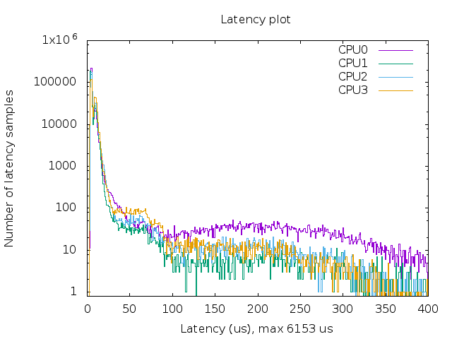
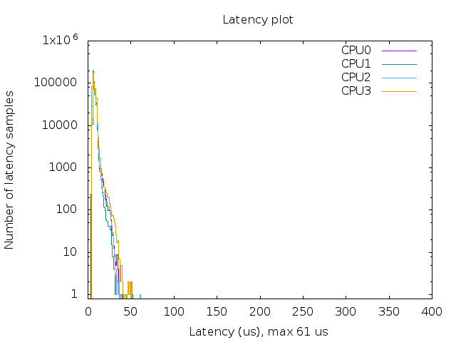

# Ubuntu-RT-UP-Board

An [UP board](https://up-board.org/) Ubuntu **real-time** patched kernel (4.4.86).

## Grab & Go!
Here's a compiled image for UP Board. Copy and paste following in your terminal:

```bash
wget -c "https://github.com/QiayuanLiao/Ubuntu-RT-UP-Board/releases/download/UP-board-4.4.86-rt99/UP-board-4.4.86-rt99.tar.xz" && tar -xvzf UP-board-4.4.86-rt99.tar.xz
```

You are all set now! For the next step:

1. If you need help to [replace the kernel](#Replace-the-kernel) or [install Ubuntu](#Install-Ubuntu), please follow the link and read on.
2. To test this kernel please refer to [Configuration and Test](#Configuration-and-Test)
3. Also if you want to [build from source](#Build-from-source), here is the tutorial.
4. Finally, here's a step by step tutorial to [build from generic kernel](#Build-from-generic-kernel-step-by-step)

## Features

- The UP board patches is modify from this [repo](https://github.com/emutex/meta-up-board/tree/krogoth) to work with kernel version 4.4.86
- Supported Buses:
  - GPIO
  - UART
  - SPI
  - I2C
  - LEDs
- Unsupported:
  - HDMI Audio
  - PWM(frequency error)
## Help Desk

### Replace the kernel

1. Copy the Debian packages to UP board

2. Remove all the generic installed kernel

   ```
   sudo apt-get autoremove --purge 'linux-.*generic'
   ```

3. Go to the file of debian packages and install the kernel:

   ```
   sudo dpkg -i linux-*.deb
   ```

4. Reboot

   ```
   sudo reboot
   ```

5. Verify that the kernel is indeed installed by typing

   ```
   uname -v
   ```

   you should get

   ```
   #1 SMP PREEMPT RT xxxxxxxx
   ```

### Install Ubuntu

1. Download Ubuntu 16.04.6 ISO from the Ubuntu download page (works with desktop and server edition)

   http://releases.ubuntu.com/16.04/ubuntu-16.04.6-desktop-amd64.iso
   http://releases.ubuntu.com/16.04/ubuntu-16.04.6-server-amd64.iso

2. Burn the downloaded image on a USB stick. We suggest to use etcher for doing that. You can download it from:

   https://etcher.io

3. Insert the USB thumb drive in a empty USB port and proceed with a normal Ubuntu installation.

### Build from source

1. Get the source:

   ```
   git clone git@github.com:QiayuanLiao/Ubuntu-RT-UP-Board.git
   cd Ubuntu-RT-UP-Board
   ```

2. Config the kernel:

   ```
   cp .config kernel
   cd kernel
   make menuconfig
   ```

   selet save and exit

3. Make the kernel

   ```
   make -j`nproc` && make -j`nproc` bindeb-pk
   ```

   Then you will get:

   ```
   linux-firmware-image-4.4.86-rt99_4.4.86-rt99-1_amd64.deb
   linux-headers-4.4.86-rt99_4.4.86-rt99-1_amd64.deb
   linux-image-4.4.86-rt99_4.4.86-rt99-1_amd64.deb
   linux-libc-dev_4.4.86-rt99-1_amd64.deb
   ```

### Build from generic kernel step by step

1. Get kernel from:

   ```
   https://git.kernel.org/pub/scm/linux/kernel/git/stable/linux.git/snapshot/linux-4.4.86.tar.gz
   ```

   and decompress.

2. Get RT_PREEMPT patch from:

   https://mirrors.edge.kernel.org/pub/linux/kernel/projects/rt/4.4/older/patches-4.4.86-rt99.tar.xz

3. Get UP board patches from release

   https://github.com/QiayuanLiao/Ubuntu-RT-UP-Board/releases/download/UP-board-4.4.86-rt99/UP-borad-patches.tar.xz

4. Copy `patches-4.4.86-rt99.tar.xz` to `linux-4.4.86`, then patch:

   ```
   unxz -cd patches-4.4.86-rt99.tar.xz | patch -p1
   ```

1. Copy `UP-borad-patches.tar.xz` to `linux-4.4.86`, then patch:

   ```
   unxz -cd UP-borad-patches.tar.xz | patch -p1
   ```

2. Config and make

## Configuration and Test

### Config and test HAT device

1. Check if there are two SPI device

   ```
   ls /dev/spidev*
   ```

   you should get:

   ```
   /dev/spidev2.0  /dev/spidev2.1
   ```

2. Enable the HAT functionality from userspace

   ```
   sudo add-apt-repository ppa:ubilinux/up
   sudo apt install upboard-extras
   sudo usermod -a -G gpio ${USER}
   sudo usermod -a -G leds ${USER}
   sudo usermod -a -G spi ${USER}
   sudo usermod -a -G i2c ${USER}
   sudo usermod -a -G dialout ${USER}
   sudo reboot
   ```

3. Go to the `/test` file run the `./blink.sh`

   ```
   cd test
   sh ./blink.sh
   ```

   then the green led of UP board will blink

4. For HAT test, check

   https://wiki.up-community.org/Pinou

### Real time test using latency plot under the stress

1. Install requirement

   ```
   sudo apt install rt-tests stress gnuplot
   ```

2. Go to the `/test` file and Run the RT test

   ```
   cd test
   sudo sh  ./rt-test.sh
   ```

   The latency plot look like this:

    
    

3. Analysis:
   - More sample on the left means lower latency in general
   - More clustered samples indicate less flutter
   - The max latency should not deviate far from mean value (typically under 100us)

## Credits

@dicarlo236 helped a lot through out patching work.
